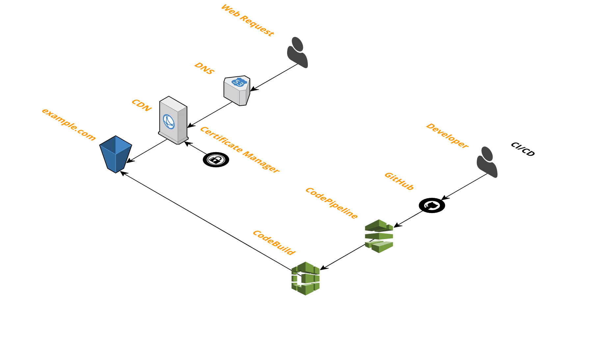

# cim.sh website
This website uses the following <a href="https://github.com/thestackshack/cim">CIM</a> template: <a href="https://github.com/thestackshack/cim/tree/master/lib/plugins/aws/ServerlessWebApp/template">serverless-web-app</a>.

## Architecture

